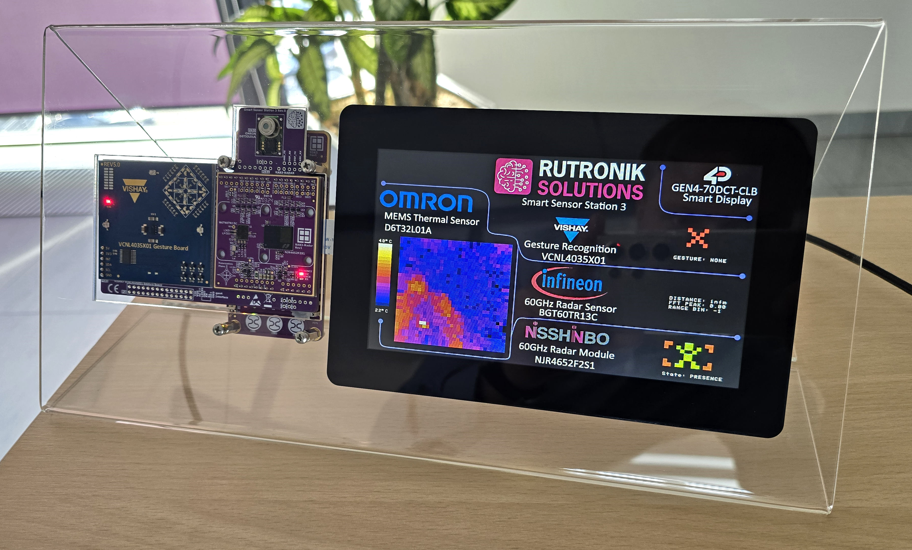

# RDK3 Smart Sensor Station Rev3

This is a ModusToolbox™ project for the SSS3 Rev3 demonstration kit featuring the Infineon BGT60TR13C 60GHz radar, NISHINNBO NJR4652F2S1 presence detection module, VISHAY VCNL4035X01 gesture control board and OMRON D6T32L01A MEMS thermal sensor.

 

## Requirements

- [ModusToolbox® software](https://www.infineon.com/cms/en/design-support/tools/sdk/modustoolbox-software/) **v3.2**: 

1. The [Python](https://www.python.org/) has to be installed manually on Windows OS.
2. Make sure the Python installation is added to the path variable. 
3. Use this command to install the [CySecureTools](https://pypi.org/project/cysecuretools/) package:

```
pip install cysecuretools
```

## Provisioning

The RDK3 has been provisioned using *policy_single_CM0_CM4_smif.json.* This type of provisioning has been chosen because it extends internal flash capacity to 0xD0000 kb. The second image on SMIF external memory is never used in this demo.

## Operation

**The Smart Sensor Station 3** is plug and play project for the demonstration of Rutronik System Solutions innovations.

The **RDK3** board and its main controller PSoC™64 - CYB06447BZI-BLD53 are collecting, and processing the data from the sensors and sending the information that is shown on a smart display module.

**VISHAY Gesture Board VCNL4035X01** is used for the recognition of the RIGHT, LEFT, UP and DOWN directions. The recognised gesture is displayed on the board and in the smart display module.

**OMRON D6T32L01A Thermal Sensor**. The 1024 pixels are read approx. every 100 ms and are processed with the PSoC™64 and the 32x32 pixels image is displayed on the screen. The scale between the maximum and minimum measured temperatures of every frame is also shown on the screen.

**Infineon BGT60TR13C 60GHz Radar Sensor** is used for static distance measurements. The current configuration gives a maximum possible distance of 6.0 meters with a resolution of 5 centimetres. The measurement frame rate is 5Hz. The results are displayed on the smart display module’s screen.

**NISHINNBO NJR4652F2S1 60GHz Presence Detection Module** is used to detect human presence. The result may be seen from the colour of LEDs – RED means a PRESENCE and GREEN means an ABSENCE. The module has the factory configuration hence the presence may be detected up to 2 meters and the result is also displayed on the screen.

The **4D SYSTEMS Smart Display Module gen4-uLCD-70DCT-CLB-AR** is updated via UART at 1093750 kbit/s. The project is made with  WORKSHOP4 IDE ViSi.

## Legal Disclaimer

The evaluation board including the software is for testing purposes only and, because it has limited functions and limited resilience, is not suitable for permanent use under real conditions. If the evaluation board is nevertheless used under real conditions, this is done at one’s responsibility; any liability of Rutronik is insofar excluded. 


